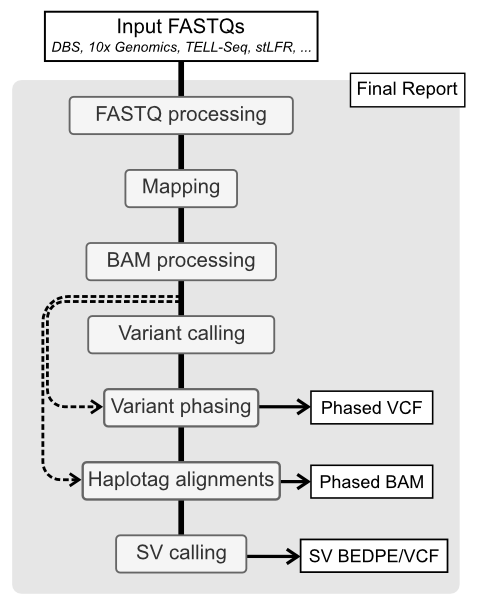

[](https://github.com/AfshinLab/BLR/actions/workflows/ci.yml) [](https://github.com/AfshinLab/BLR/actions/workflows/ci_macos.yml)
- [About the pipeline](#About-the-pipeline)
- [Usage](#Usage)
- [Installation](#Installation)
- [Testrun](#testrun)
- [Development](#development)
- [Citation](#citation)

## About the pipeline

The BLR pipeline is end-to-end Snakemake workflow for whole genome haplotyping and structural variant calling from FASTQs, independent of LongRanger. The pipeline allow for input FASTQs from multiple linked-read technologies such as:

- [Droplet Barcode Sequencing (DBS)](doc/platforms.rst#dbs)
- [10x Genomics Chromium Genome](doc/platforms.rst#x-genomics)
- [Universal Sequencing TELL-seq](doc/platforms.rst#tell-seq)
- [MGI stLFR](doc/platforms.rst#stlfr)

Read more about the integrated linked-read platforms [here](doc/platforms.rst).



The BLR pipeline is designed to be flexible and modular, allowing for easy integration of new linked-read technologies and tools. The pipeline is also designed to be run on a cluster environment, but can also be run locally.

Outlined below are the main processing step. Tools written in parenthesis indicate which are currently implemented for the current step with the preferred tool in *italic*.

- **FASTQ processing** (*tool depends on technology*): This initial step normalizes input FASTQ based on the linked-read technology used. This includes demultiplexing, barcode extraction and filtering as well as adaptor trimming.
- **Mapping** (*EMA*, BWA, minimap2, bowtie2, lariat): The reads are mapped to the reference genome using one of the available mappers. 
- **BAM processing** (*BLR/Picard MarkDuplicates*): Collapse overlapping barcodes, mark duplicates, infer molecules (MI-tag) and filter reads. 
- **Variant calling** (*DeepVariant*, GATK, FreeBayes, BCFtools): Call and filter short variants.
- **Variant phasing** (*HapCUT2*): Phase variants using the inferred molecules.
- **Haplotag alignments** (*WhatsHap*): Assign haplotype to reads (HP-tag).
- **Structural variant (SV) calling** (*NAIBR*): Call large structural variants (SV).

Statistics are collected using standards tools such as FastQC, Picard and mosdepth as well as custom scripts that are part of BLR. These are then complied using [MultiQC](https://multiqc.info/) into a final HTML report.

## Usage

- [1. Setup analysis](#1-setup-an-analysis-folder)
- [2. Run analysis](#2-running-an-analysis)
- [3. Test files](#3-test-files)
- [4. Reference genome setup](#4-reference-genome-setup)
- [5. Merging different analysis runs](#5-merging-different-analysis-runs)
- [6. MultiQC plugin](#6-multiqc-plugin)

### 1. Setup an analysis folder

Activate your generated conda environment (see [Installation](#Installation)).

    conda activate blr

Create the analysis directory using `blr init`. Choose a name for the analysis, `output_folder` in this example. Specify the library type using the `-l` flag, here we choose `dbs`.

    blr init --reads1=path/to/sample.R1.fastq.gz -l dbs path/to/output_folder

Note that BLR expects paired-end reads. However, only the path to the R1 file needs to be provided. The R2 file will be found automatically.

Move into your newly created analysis folder.

    cd path/to/output_folder

Then, you may need to edit the configuration file `blr.yaml`, in particular
 to enter the path to your indexed reference genome (see [Reference genome
  setup](#4-reference-genome-setup) for more info).

    blr config --set genome_reference path/to/GRCh38.fasta

To see what other configurations can be altered, read the documentation in
 the `blr.yaml` file or run `blr config` to print the current configs to the
  terminal. Some configurations are specific to the linked
  -read technology used for generating the library, more information can be
   found [here](doc/platforms.rst).

### 2. Running an analysis

Change working directory to your analysis folder

    cd path/to/output_folder

The pipeline it launched using the `blr run` command. To automatically runs all steps run:

    blr run

For more options, see the documentation.

    blr run -h

### 3. Test files

Testdata is provided in the `tests/testdata` directory. Unit tests can be run locally from within the BLR directory using:

    bash tests/run.sh

This is useful if you want to test your changes localy before submitting them as a PR.

If you which to a testrun on a small dataset see the [Testrun](#testrun) section. 

### 4. Reference genome setup

To run the pipeline you need to provide a path to a FASTA with your reference
 genome. The FASTA should be indexed depending on which mapper you whish to
  use.

 - `bowtie2` uses a `bowtie2`-indexed reference


        bowtie2-build genome.fasta genome.fasta

 - `bwa`, `minimap2`, `ema` and `lariat` uses a `bwa`-indexed reference


        bwa index genome.fasta

Additionally you need to index your FASTA using `samtools faidx` to get the
 `genome.fasta.fai` file

    samtools faidx genome.fasta

If using `gatk` for variant calling or doing base recalibrartion you will
 need to generate a sequence dictionary (`genome.dict` file) which can be done
  using:

    gatk CreateSequenceDictionary -R genome.fasta

### 5. Merging different analysis runs

If you have two or more libraries run on the same sample it is possible to
 merge these inorder to increase coverage. First analysis should be run
  separately for each library. Make sure that different `sample_nr` (set
   using `blr config`) have been assigned to each library in order to not mix
    overlapping barcodes. The files that will be merged from each library is
     the filtered BAM (`final.phased.cram`, `final.phased.bam` or `final.bam`), the
      molecule stats TSV (`final.molecule_stats.filtered.tsv`) and for DBS
       and TELL-seq libraries the clustered barcodes (`barcodes.clstr.gz`).

To merge the different runs we initialize a new analysis folder using `blr init`. In this example we have analysed two DBS library runs called `MySample_1` and `MySample_2`. Using the command below we can initialize a new folder called `MySample_merged`.

    blr init -w /path/to/MySample_1 -w /path/to/MySample_2 --library-type dbs MySample_merged

Configs can then be updated as usual using `blr config`.

In order to merge the files and run analysis on the merged files a special subscript need to be run. This is done by running:

    blr run --anew

Using this the files will be merged and the workflow run from varinat calling
 and on.

 Note that this approach can also be used to rerun a single sample with
  different configurations from variant calling and on.

### 6. MultiQC plugin

There is a MultiQC plugin included in the BLR pipeline called MultiQC_BLR. If you wish to run MultiQC without this plugin include `--disable-blr-plugin` in your multiqc command.

The plugin allows for comparison between different runs. In this case go to the directory containing the folders for the runs you wish to compare. Then run:

    multiqc -d .

The `-d` option prepends the directory name to each sample allowing differentiation between the runs.

## Installation

- [1. Setup conda](#1-setup-conda)
- [2. Create environment and install `blr`](#2-create-environment-and-install-blr)
- [3. Optional installations](#3-optional-installations)
- [4. Reusing conda environments](#4-reusing-conda-environments)

### 1. Setup conda

Install [miniconda](https://docs.conda.io/en/latest/miniconda.html) if not already installed. You could also try copy-pasting the following to your terminal. This will download miniconda, install it to you `$HOME` folder.

    if [[ $OSTYPE = "linux-gnu" ]]; then
        wget http://repo.continuum.io/miniconda/Miniconda3-latest-Linux-x86_64.sh -O miniconda.sh
    elif [[ $OSTYPE = "darwin"* ]]; then
        wget https://repo.anaconda.com/miniconda/Miniconda3-latest-MacOSX-x86_64.sh -O miniconda.sh
    fi
    bash miniconda.sh -b -p $HOME/miniconda
    source $HOME/miniconda/etc/profile.d/conda.sh

### 2. Create environment and install `blr`

Clone the BLR repository.

    git clone https://github.com/AfshinLab/BLR.git

Install [conda-lock](https://github.com/conda-incubator/conda-lock#installation).

    conda install -c conda-forge conda-lock

Create a conda environment, in which all dependencies will be installed. It
 is recommended to use one of the OS locked files, i.e. `environment.linux-64
  .lock` for linux or `environment.osx-64.lock` for mac, for reproducibility. One can also use the non-lock `environment.yml` file but this may introduce non-tested versions of software into the environment, so use with caution. For linux use the following to install and activate the environment.

    conda create --name blr --file environment.linux-64.lock
    conda activate blr

Install `blr` into the environment.

    pip install .

For development it can be useful to install `blr` in editable mode in this case use `pip install -e .`. This will install blr in such a way that you can still modify the source code and get any changes immediately without re-installing.

### 3. Optional installations

Here are some optional installs that are required if a specific software is requested.

#### 3.1 DeepVariant

To enable [DeepVariant](https://github.com/google/deepvariant), install it separately to your environment. Note that it is currently only available for linux.

    conda activate blr
    conda install deepvariant

To use DeepVariant for variant calling in your analysis, run:

    blr config --set variant_caller deepvariant

#### 3.2 Lariat aligner

To use [lariat](https://github.com/10XGenomics/lariat) for alignment you need to manually install it within your environment. For help on installation see [the following instructions](doc/lariat_install.rst). To enable mapping using lariat, run:

    blr config --set read_mapper lariat

#### 3.3 NAIBR (older versions)

The latest version of the [NAIBR repo](https://github.com/raphael-group/NAIBR) will be downloaded and used automatically. If you want to use another version of NAIBR this can be set through:

    blr config --set naibr_path /path/to/NAIBR/

### 4. Reusing conda environments

Snakemake will generate separate conda environments for certain tools, e.g
. NAIBR, when needed. These are by default generated in the `.snakemake/conda
 /` folder within the analysis directory. To reuse the same
  enviroment across different runs its possible to set the environment
   variable `$CONDA_ENVS` with the path to a common directory where
    environments can be reused or generated as needed. To set the environment
     variable temporary one can use:

    export CONDA_ENVS=/path/to/common/conda-envs/

It is also possible to set this variable as a part of the main conda
 environment (in this case `blr`) using the following command:

    conda env config vars set CONDA_ENVS=/path/to/common/conda-envs/ -n blr

Deactivate and re-activate the environment for the change to take effect. To
 remove this variable from the environment run:

    conda env config vars unset CONDA_ENVS -n blr

## Testrun 

Once everything has been installed it possible to perform a testrun. Testdata is provided in the `tests/testdata` directory. 

Below are the steps to setup and run a `dbs` dataset testrun. 

1. Index the reference FASTA if not already done.

```{bash}
pushd tests/testdata
bwa index ref.fasta
bowtie2-build ref.fasta ref.fasta > /dev/null
samtools faidx ref.fasta
test -f ref.dict || gatk CreateSequenceDictionary -R ref.fasta
popd
```

2. Initialize and move into the work directory.

```{bash}
blr init dbs_testrun --r1 tests/testdata/dbs_reads.1.fastq.gz -l dbs
cd dbs_testrun
```

3. Update the configs.

```{bash}
blr config -s genome_reference ../tests/testdata/ref.fasta -s chunk_size 50000 -s phasing_contigs null -s min_mapq 0 -s fastq_bins 5
```

4. Run the pipeline

```{bash}
blr run 
```

## Development

For more information on development go [here](doc/develop.rst).

## Citation

The BLR pipeline is outlined in:

> Höjer, P., Frick, T., Siga, H. *et al.* BLR: a flexible pipeline for haplotype analysis of multiple linked-read technologies, *Nucleic Acids Research*, gkad1010 (2023). https://doi.org/10.1093/nar/gkad1010

This is the main citation for the BLR pipeline. 

BLR was originally developed for the prep-processing of [Droplet Barcode Sequencing (DBS)](doc/platforms.rst#dbs) data for input into the 10x LongRanger pipeline, see paper 

> Redin, D., Frick, T., Aghelpasand, H. *et al.* High throughput barcoding method for genome-scale phasing. *Sci Rep* 9, 18116 (2019). https://doi.org/10.1038/s41598-019-54446-x

It has since been heavily modified to run completely independant of LongRanger. To run the analysis described in [Redin et al. 2019][2] look at the [stable branch](https://github.com/AfshinLab/BLR/tree/stable) for this git repository. That version is also available at [OMICtools](https://omictools.com/blr-tool).

[1]: https://doi.org/10.1093/nar/gkad1010 "Höjer et al. 2023"
[2]: https://doi.org/10.1038/s41598-019-54446-x "Redin et al. 2019"
